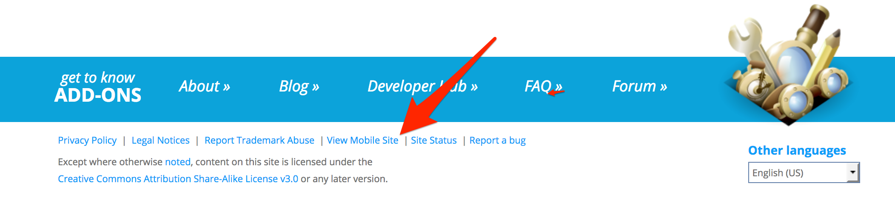

Localization (l10n)
=====================

These notes are primarily to support localizers working on localizations
related to https://addons.mozilla.org/.

Projects
--------

There are two core projects for AMO that require localization:

    * `addons-server <https://github.com/mozilla/addons-server/>`_ (`addons-server on Pontoon`_)
    * `addons-frontend <https://github.com/mozilla/addons-frontend/>`_ (`addons-frontend on Pontoon`_)

Both of these projects use `Pontoon`_ for translations.

addons-server
+++++++++++++

Addons-server is the default front-end for desktop users of AMO, it is also
the API backend and home to the developer hub and reviewer tools. It is
written in Python using the Django Framework.

Testing changes to addons-server localizations
~~~~~~~~~~~~~~~~~~~~~~~~~~~~~~~~~~~~~~~~~~~~~~

The strings will be available on `dev <https://addons-dev.allizom.org/>`_ or
`stage <https://addons.allizom.org/>`_ depending on when they were
committed see `When can I expect to see my strings land?`_ for details.

The relevant hosts for addons-server are as follows:

    * dev https://addons-dev.allizom.org/
    * stage https://addons.allizom.org/
    * prod https://addons.mozilla.org/

addons-frontend
+++++++++++++++

Addons-frontend is the new frontend and default frontend for mobile user-agents,
it will eventually replace the addons-server frontend for user-pages. It is
written in JavaScript and uses React at its core. Addons-frontend
currently provides an amo app (amo.po).

Testing amo localizations
~~~~~~~~~~~~~~~~~~~~~~~~~

The strings will be available on `dev`_ or `stage`_ depending on when they
were committed see `When can I expect to see my strings land?`_ for details.

The hosts for the new frontend are the same as addons-server except
to be routed to the new frontend you either need:

    * A "mamo" cookie with the value "on". You can set this by clicking
      "View mobile site" in the footer.
    * A Mobile user-agent string.

Advanced Configuration for testing addons-frontend strings
++++++++++++++++++++++++++++++++++++++++++++++++++++++++++

This will be enough for basic string checks. If you need to test strings
related to the install buttons you will need to enabled preferences to allow
add-on installation to work on the development and stage servers.

To fully configure Firefox to install add-ons on either dev/stage you will
need to additionally do the following:

    * Use Firefox Nightly or Firefox Developer Edition
    * A `new profile`_ is recommended since changing the dev certs will mark
      existing add-on installs as invalid (this change is not immediate).
    * Go to ``about:config`` and set ``extensions.webapi.testing`` as a
      Boolean to ``true``.
    * To install an add-on, you will need to be able to install a signed
      add-on from dev or stage. Create the ``xpinstall.signatures.dev-root``
      pref in ``about:config`` as a Boolean and set it to ``true``.
    * If you see warnings when trying to install a theme or theme previews
      don't work go to ``about:preferences#security`` and add an exception
      for dev/stage (See the "Exceptions" button next to "Warn me when
      sites try to install add-ons").
    * Restart the browser.

Routine Extraction of new strings
---------------------------------

Newly added strings are extracted every week after the tag which is at 9am PST
on Tuesdays.

.. _when_can_i_see_strings:

When can I expect to see my strings land?
-----------------------------------------

Once translations are commmitted into our repositories they are visible on
our dev server within 30mins (or as long as it takes to deploy the code).

Master is tagged and pushed to stage weekly at around 9am PST every Tuesday.

The code is released to production every Thursday. The push generally starts
around 9am PST.

Debug locales
-------------

There are two debug locales generated from the English keys. These can be
useful to detect strings that are not marked for extraction.

The debug locales are called ``dbl`` (Debug left to right) and ``dbr``
(Debug right to left). The tool used to build these is called `potools`_
and it is both HTML and placeholder aware, to provide more accurate
simulated localizations.

To access a debug locale simply replace the current locale in the url of the
page you are on.

E.g: ``https://addons-dev.allizom.org/en-US/firefox/`` becomes
``https://addons-dev.allizom.org/dbr/firefox/``.

.. _`dev`: https://addons-dev.allizom.org/
.. _`stage`: https://addons.allizom.org/
.. _`potools`: https://github.com/mozilla/potools/
.. _`Pontoon`: https://pontoon.mozilla.org/
.. _`addons-server on Pontoon`: https://pontoon.mozilla.org/projects/amo/info/
.. _`addons-frontend on Pontoon`: https://pontoon.mozilla.org/projects/amo-frontend/info/
.. _`new profile`: https://support.mozilla.org/kb/profile-manager-create-remove-switch-firefox-profiles

