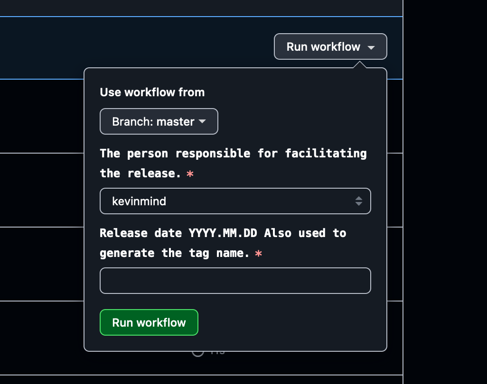
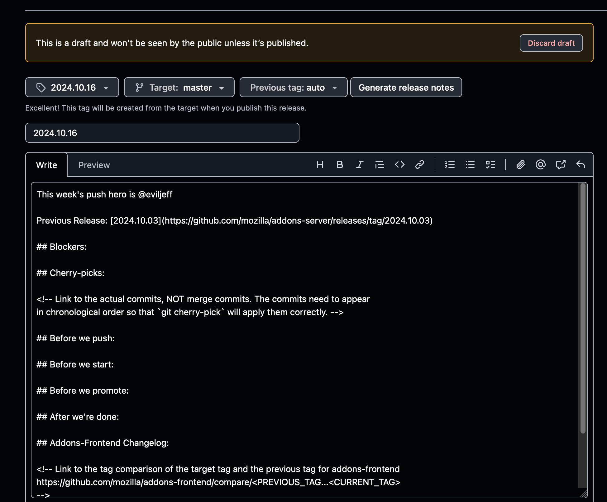
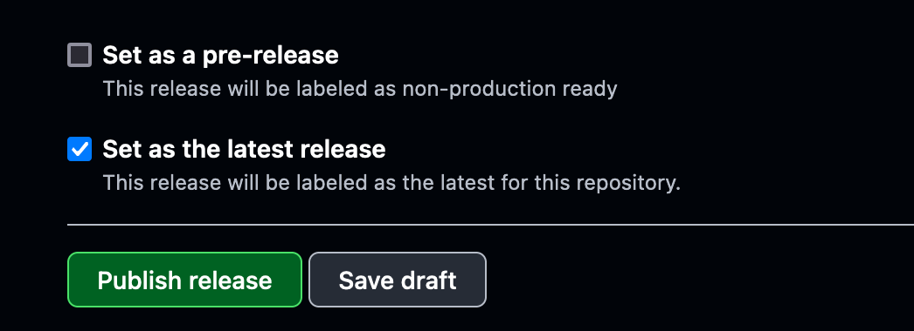

# release-docs

Until August 22nd 2024, we managed our release documents manually in the addons repository (see [release-docs.rst][addons-releases]).

Currently, [addons-server][addons-server] is the only repository deploying via [github releases][addons-server-releases].

## Creating a new release

To create a new release, use the [draft release workflow][draft-release-workflow].



This will create a new draft release in the repository. This release can be updated with instructions and things to note for the next push.
You need to set the push hero (see [push-duty](./index.md) for the rotation) as the assignee for the draft release.
You also need to specify the next push date. This will be roughly 2 weeks after the current push. The exact date will correspond
with the next jira sprint.

## Publishing a release

During the tag, we can trigger a staging deployment for `addons-server` by publishing the current draft release
that should have been created at the end of the last push. It will likely be the first release in the [list][addons-server-releases]
and will match the current push tag date.

In order to publish the release, click the edit icon at the top right of the release card.

- Update the release notes by clicking the `Generate release notes` button.
- Publish the release by clicking the `Publish release` button.
- Include the compare link for `addons-frontend`. See [tagging](./tag-services.md) for details.



```{warning}
Make sure that the release is tagged as "latest". This is the default behavior but don't accidentally un-check it.
```



Publishing a release will trigger the [release workflow][release-workflow].

The workflow will:

- generate a tag for the release based on the specified tag (should use the date timestamp see [tag-services](./tag-services))
- run our full CI pipeline on the tag
- trigger a stage deployment for the tag

### Failing CI

Github unfortunately does not link workflows to releases that triggered them. You can inspect [Failed CI][failed-ci-query]
to see workflows triggered by a release event that failed.

```{tip}
We should include slack notifications for failed CI, especially on deployment triggering workflow runs.
```

[failed-ci-query]: https://github.com/mozilla/addons-server/actions/workflows/ci.yml?query=event%3Arelease+is%3Afailure
[release-workflow]: https://github.com/mozilla/addons-server/actions/workflows/release.yml
[draft-release-workflow]: https://github.com/mozilla/addons-server/actions/workflows/draft_release.yml
[addons-server]: https://github.com/mozilla/addons-server
[addons-server-releases]: https://github.com/mozilla/addons-server/releases
[addons-releases]: https://github.com/mozilla/addons/tree/main/releases
