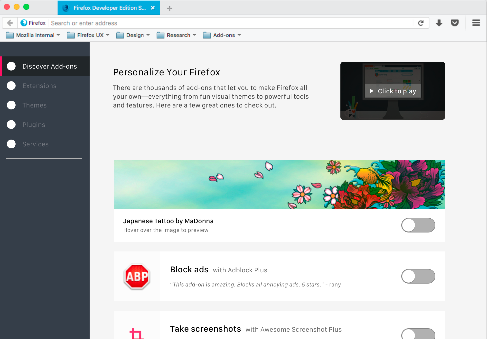
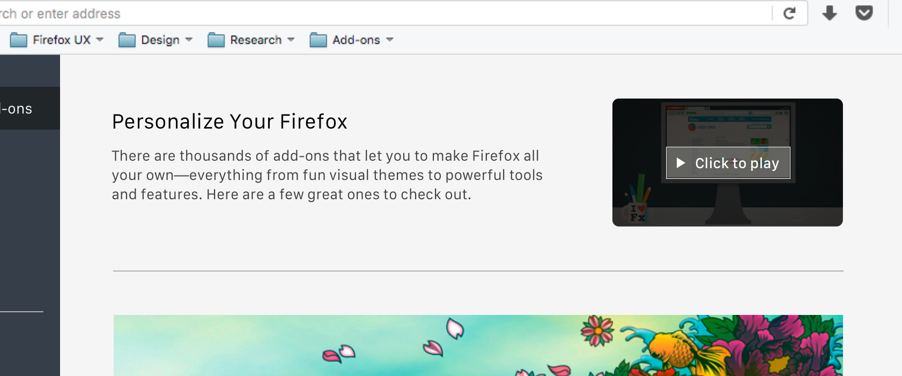
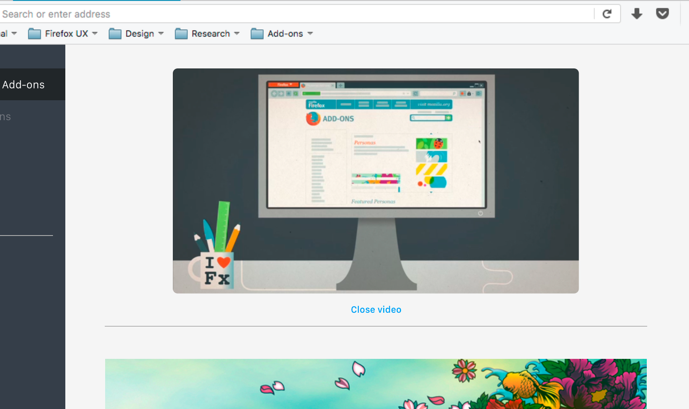
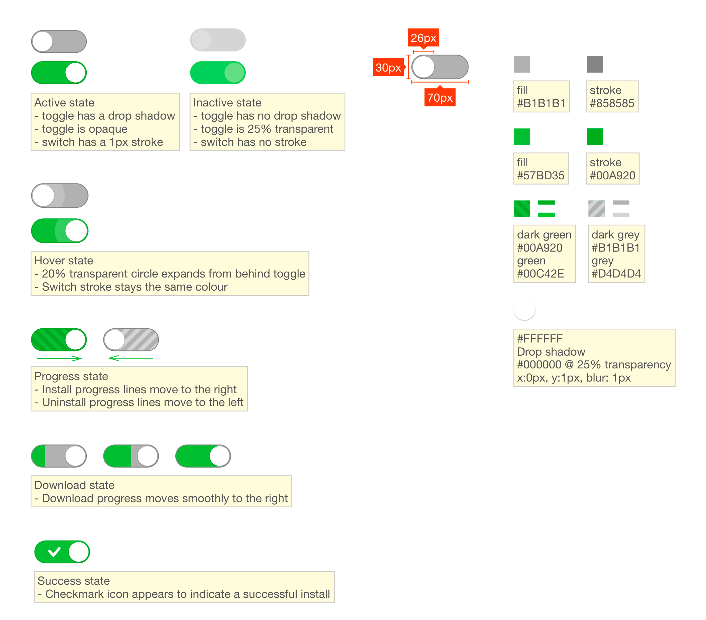
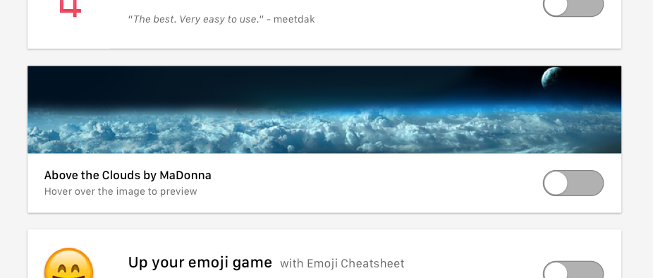
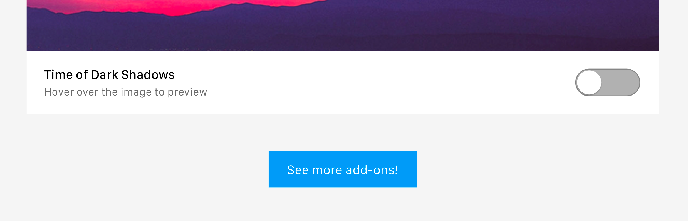

Add-ons Discovery Pane UX Specs
===============================

So I can find useful and trusted add-ons, as a new add-ons user, I want to browse from a small list of curated content.

'Intro Video <https://github.com/mozilla/addons/issues/83>'
-----------

* When a user clicks "Click to play", the copy to the left of the video thumbnail will fade away and the thumbnail will expand down and to the left.

* When a user clicks "close video" below the expanded video, the video will shrink up and to the right back to its original position. The copy to the left will fade back in.

'Switch Interaction <https://github.com/mozilla/addons/issues/63>'
------------------

* When a user turns on the switch, the install process begins: the switch shows download and install progress. When complete, a check mark appears in the switch.
* When a user turns off the switch, the uninstall process begins: the switch shows uninstall progress. When complete, the switch returns to original off state.

Theme Interaction
-----------------

* When hovering over the theme image, the toolbar will change to show a preview.

AMO Link
--------

* A button at the bottom of the discovery pane encourages users to visit AMO if they want to explore add-ons and themes further.
